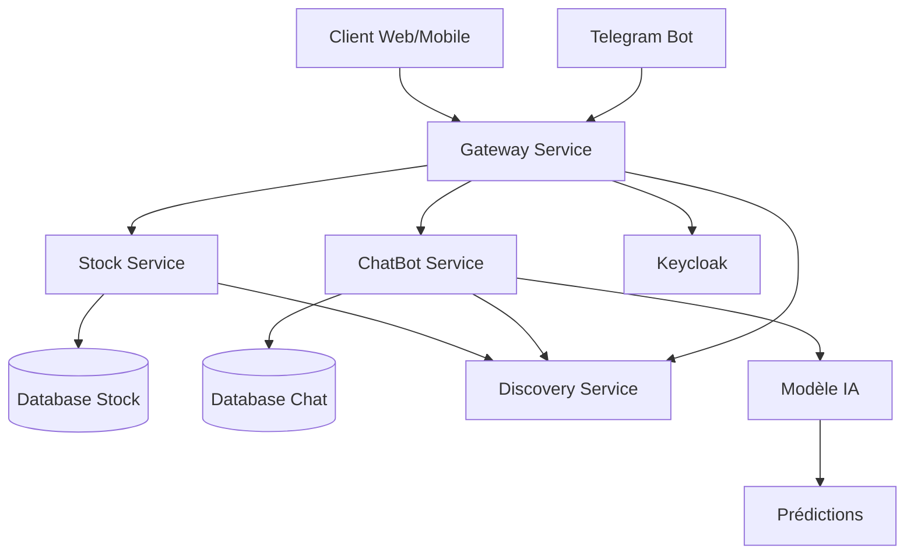

#   Enset Adria Stock Market Test : Système de Gestion des Cotations Boursières - Architecture Micro-services

## 📋 Table des Matières
- [Description du Projet](#description-du-projet)
- [Architecture Technique](#architecture-technique)
- [Micro-services](#micro-services)
- [Technologies Utilisées](#technologies-utilisées)
- [Installation et Démarrage](#installation-et-démarrage)
- [API Endpoints](#api-endpoints)
- [Sécurité](#sécurité)
- [Intelligence Artificielle](#intelligence-artificielle)
- [DevOps](#devops)
- [Développement](#développement)

## 🎯 Description du Projet

Ce projet consiste en un système distribué basé sur une architecture micro-services pour la gestion des cotations boursières des entreprises. Le système inclut des fonctionnalités de gestion des cotations, un chatbot AI intégré à Telegram, et une interface web/mobile.

### Fonctionnalités Principales
- **Gestion des cotations boursières** (ajout, suppression, consultation)
- **Chatbot AI** pour interactions via Telegram
- **Interface web** pour la visualisation
- **Sécurité** basée sur OAuth2, OpenID Connect et JWT

## 🏗️ Architecture Technique


pour la bien visualisé


### Composants Architecturels

- **Discovery Service** : Service d'enregistrement et de découverte (Eureka/Consul)
- **Gateway Service** : Point d'entrée unique avec routage intelligent
- **Stock Service** : Micro-service de gestion des cotations
- **ChatBot Service** : Service d'agent AI pour Telegram
- **Base de Données** : H2 
- **Sécurité** : Keycloak pour l'authentification/autorisation

## 🔧 Micro-services

### 1. Stock Service
**Entité StockMarket :**
```java
@Entity
public class StockMarket {
    private Long id;
    private LocalDate date;
    private Double openValue;
    private Double closeValue;
    private Long volume;
    private String companyId;
}
```

**Fonctionnalités :**
- `POST /api/stocks` - Ajouter une cotation

  et voila le resultas de ce test
  
  je peux aussi se beneficier de :

- `DELETE /api/stocks/{id}` - Supprimer une cotation
- `GET /api/stocks` - Consulter toutes les cotations
- `GET /api/stocks/{id}` - Consulter une cotation
### 2. Discovery Service
Service d'enregistrement basé sur Spring Cloud Eureka permettant la découverte dynamique des services.
il est bien lancer


### 3. Gateway Service
Gateway réactive fournissant :
- Routage des requêtes
- Authentification centralisée
- Load balancing
- Rate limiting

### 4. ChatBot Service
Agent AI intégrant :
- Connexion MCP aux micro-services
- Interface Telegram
- Modèle LLM pour le raisonnement
- Outils d'interaction avec les services

## 🛠️ Technologies Utilisées

### Backend
- **Java 21** avec Spring Boot 3.x
- **Spring Cloud** (Gateway, Eureka, Config)
- **Spring Security** avec OAuth2/OpenID
- **Spring Data JPA**
- **Maven** pour la gestion des dépendances
- **H2** - Base de données
- **Keycloak** - Serveur d'authentification

### Frontend
- **React/Angular** (au choix)
- **npx @modelcontextprotocol/inspector node chemin/vers/tonServeur.js** pour avoir une interface ineractive

### IA & Analytics
- **Python** avec TensorFlow/PyTorch
- **Scikit-learn** pour les modèles ML
- **Jupyter Notebooks** pour l'analyse
- **MCP** (Model Context Protocol)


##  Installation et Démarrage

### Prérequis
- Java 21
- Maven 
- H2
- Docker & Docker Compose
- angular (pour le frontend)

### 1. Clonage du Repository
```bash
git clone https://github.com/votre-username/enset-adria-stock-market-test.git
cd enset-adria-stock-market-test
```


### 4. Démarrage Manuel
```bash
# Démarrer dans l'ordre
mvn spring-boot:run -pl discovery-service
mvn spring-boot:run -pl stock-service  
mvn spring-boot:run -pl gateway-service
mvn spring-boot:run -pl chatbot-service
```

## 📡 API Endpoints

### Stock Service
| Méthode | Endpoint | Description |
|---------|----------|-------------|
| GET | `/api/stocks` | Liste toutes les cotations |
| GET | `/api/stocks/{id}` | Obtenir une cotation par ID |
| POST | `/api/stocks` | Ajouter une nouvelle cotation |
| DELETE | `/api/stocks/{id}` | Supprimer une cotation |
| PUT | `/api/stocks/update-current-price/{companyId}` | Mettre à jour le prix actuel |

### Exemple de Requête
```bash
# Ajouter une cotation
curl -X POST http://localhost:8081/api/stocks \
  -H "Content-Type: application/json" \
  -H "Authorization: Bearer {token}" \
  -d '{
    "date": "2024-01-15",
    "openValue": 150.25,
    "closeValue": 152.30,
    "volume": 1000000,
    "companyId": "AAPL"
  }'
```


## 🔒 Sécurité

### Configuration Keycloak

### Rôles et Permissions
- **ROLE_USER** : Consultation des cotations
- **ROLE_ADMIN** : Gestion complète des cotations
- **ROLE_AI_AGENT** : Accès pour le chatbot


##  Microservice ChatBot avec Telegram

Le microservice **ChatBot Service** a été développé pour offrir une interface conversationnelle intelligente via Telegram, permettant aux utilisateurs d'interagir naturellement avec le système de gestion des cotations boursières. Ce service intègre un agent IA capable de comprendre les requêtes en langage naturel et d'y répondre en temps réel en accédant aux données des autres microservices via le protocole MCP (Model Context Protocol).

**Fonctionnalités principales :**
- **Interface Telegram** complète avec support des commandes et messages textuels
- **Agent IA intelligent** avec compréhension du langage naturel pour les requêtes boursières
- **Intégration MCP** pour communiquer avec les autres microservices (Stock-Service)
- **Gestion des conversations** persistante avec historique des échanges
- **Reconnaissance d'intentions** pour le prix des actions, les prédictions, et l'aide
- **Formatage riche** des réponses avec emojis et mise en forme Markdown

**Architecture technique :** Spring Boot + Telegram Bot API + PostgreSQL + Spring Data JPA + Spring Cloud Eureka + MCP Protocol. Le service expose à la fois une API REST et une interface Telegram, tout en étant enregistré dans le service de découverte pour une intégration transparente avec l'écosystème microservices.


    voila son architechture
    


---


